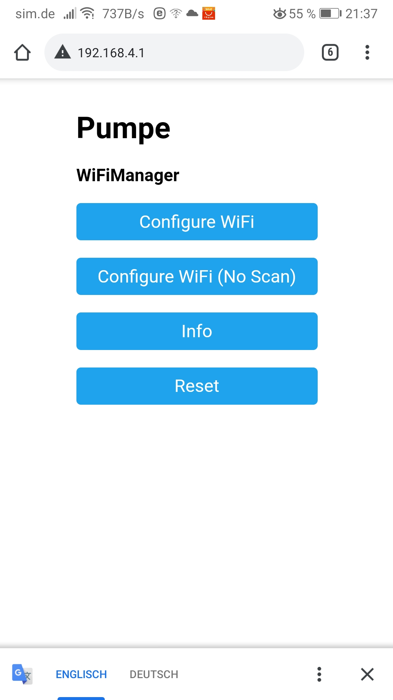
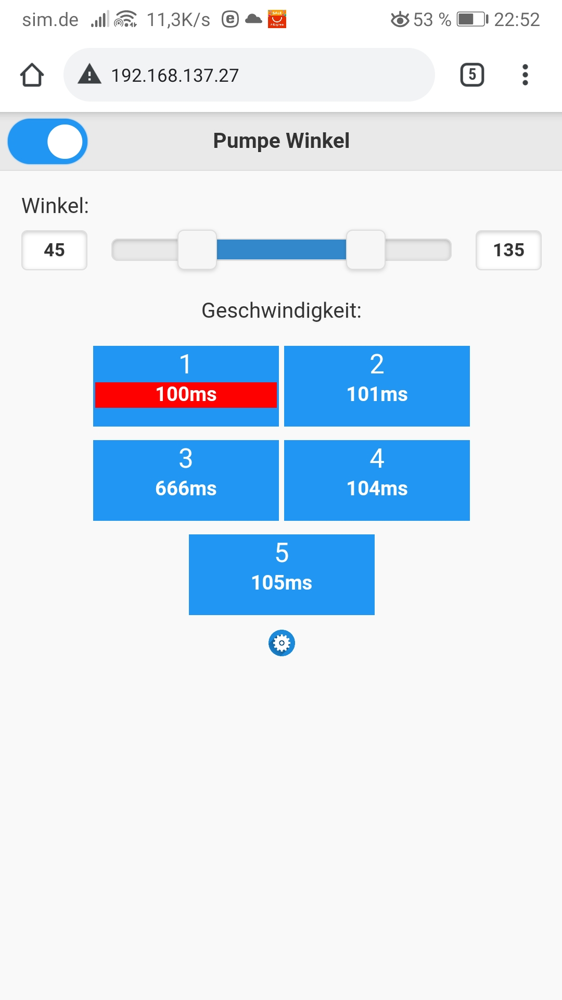
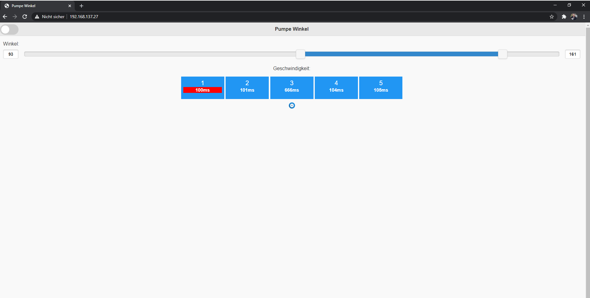
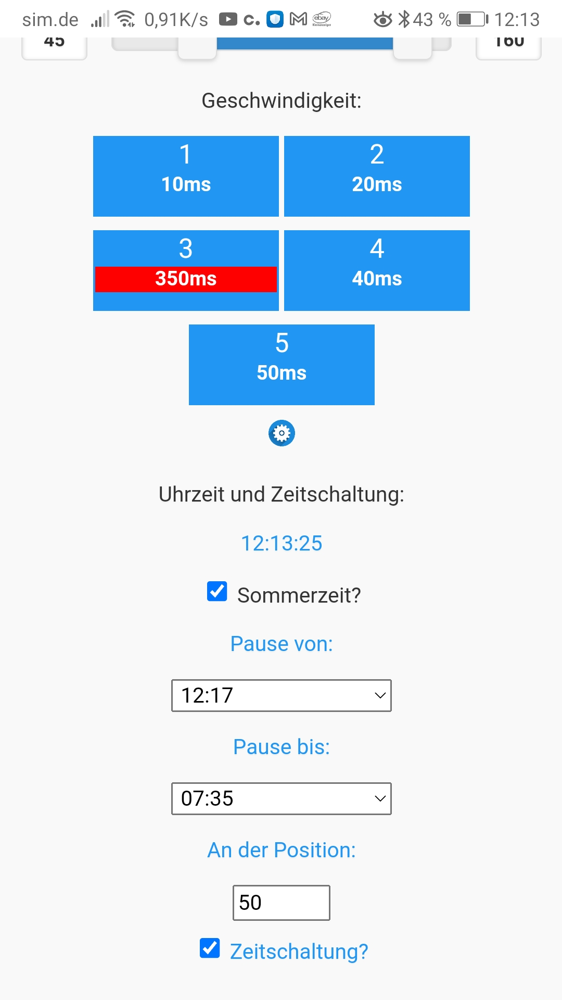
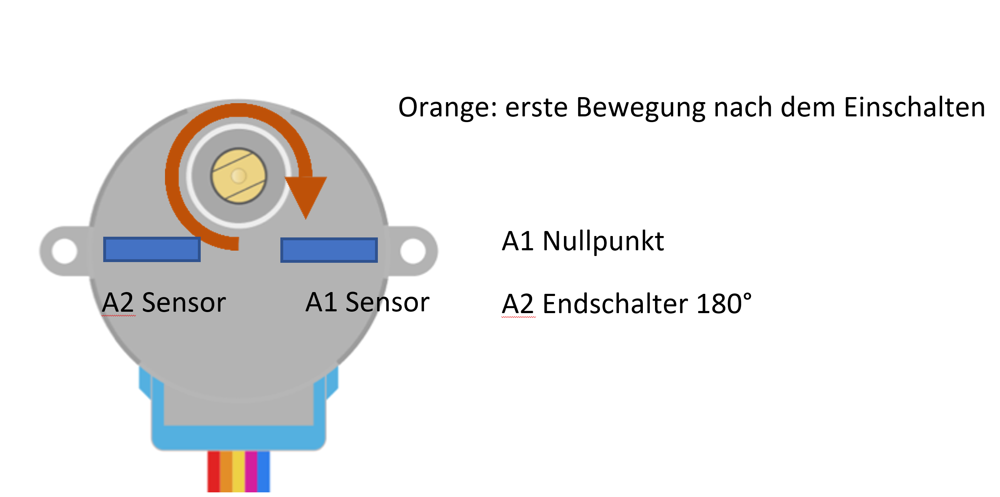

# Aquarium Stroemungspumpe Winkelsteuerung
Dieses Repository beinhaltet Software zur Steuerung einer Strömungspumpe.

**Schnellstart mit vorkompilierten Files: siehe README (ziemlich am Ende)**

## 1. Installation von der Arduino IDE und Einbindung von ESP8266 und ESP32.
Arduino Installation: [Arduino Download](https://www.arduino.cc/en/software)

Nach der Installation beide Bord URLS unter Voreinstellung eintragen.
Bord URL's:

    https://dl.espressif.com/dl/package_esp32_index.json, 
  	http://arduino.esp8266.com/stable/package_esp8266com_index.json

Im Anschluss, unter Bordverwalter, beide Bords installieren.

## 2. Installation von Libraries

    https://github.com/me-no-dev/ESPAsyncWebServer
    https://github.com/me-no-dev/AsyncTCP
    https://github.com/me-no-dev/ESPAsyncTCP
    https://github.com/zhouhan0126/WIFIMANAGER-ESP32
    https://github.com/zhouhan0126/DNSServer---esp32
    https://github.com/zhouhan0126/WebServer-esp32
    
## 2.2. Info zum Hotspot Mode
[Infoseite](https://randomnerdtutorials.com/wifimanager-with-esp8266-autoconnect-custom-parameter-and-manage-your-ssid-and-password/)
Wichtig: modifizierte Library von Wifi Manager, sodass diese mit Async funktioniert.

    https://github.com/btomer/WiFiManager
    
    
## 3. Programm hochladen auf einen ESP8266/ESP32

Beim Hochladen des Programmes ist zu beachten, dass der EEPROM **zuerst** seperat geflasht wird!

1. Dafür wird das Programm im Ordner EEPROM_flasher auf den ESP geladen.

2. Danach kann das Hautprogramm auf die gleiche Art und Weise hochgeladen werden. (sketch)

## 3.2. Info zum Hauptprogramm

Im Hauptprogramm kann der GPIO Pin für den Servo hinterlegt werden und ob es sich um einen 180° Servo handelt oder einen 360° Servo.

GPIO Pin:
    
    int servopin = 15;
       
 Faktor 180/360°
 
    int factorServo = 1; //2, wenn 360°Servo.


## 4. WLAN einstellen

Wenn kein bekanntes WLAN beim Start verfügbar ist, baut der ESP ein eigenes WLAN mit der SSID "**Pumpe**" auf. Unter der IP: **192.168.4.1**, kann nun das WLAN hinterlegt werden. Danach startet der ESP neu und versucht sich zu verbinden. Wenn die funktioniert hat, verbindet sich der ESP mit dem Netzwerk und baut kein eigenes Netzwerk mehr auf.

**Das WLAN Passwort sollte nicht länger als 40Zeichen sein!**
**Die SSID sollte nicht länger sein als 30 Zeichen!**

So sieht die Webseite zum Einstellen des WLAN aus:




Damit nun der Webservice verfügbar ist, **muss** der ESP jedoch **nach der erfolgreichen Verbindung nochmal neu gestartet werden**.
Danach sollte der Webservice unter der IP vom ESP und dem Port 80 im Netzwerk erreichbar sein.

## 5. Grafisches Interface

So sieht die "Steuerungswebseite" aus:

Android Smartphone         | Windows PC 
:-------------------------:|:-------------------------:
  |  


Die Zeit pro Winkel pro Knopf, in Millisekunden, können über das Einstellungsmenü (mittlerer Knopf (Zahnrad)) eingestellt werden.

Werte zwischen **1ms und 9999999ms** werden vom Programm angenommen und abgespeichert.
Diese Werte bleiben auch nach einem Stromausfall bzw. Neustart erhalten!

### Neu:



Echtzeituhr und das Hinterlegen eines Intervalls, indem die Automatik ausgeschaltet wird.

## 6. Verkabelung

Servo Datenleitung an GPIO 15. Am Wemos D1 wäre dies D8 zum Beispiel.

Gemeinsames Ground beachten!

## 7. Besonderheit

Da die Webseite auf einem Mikrocontroller gehostet wird, werden Zusatz Pakete im Form von Javascript oder Images von externer Quelle geladen.

Das Wlan in welchem sich der ESP und das Gerät zur Steuerung (Smartphone oder Laptop etc.) befindet muss daher zwingend mit dem Internet verbunden sein.

Wenn dies nicht gewünscht ist, können die Zusatzpakete auch auf einem anderem Gerät im Netzwerk gehostet werden. (NAS System, Raspberry etc.)


Wenn der Webspeicher im Gerät nicht gelöscht wird, hinterlegt der Browser gegebenfalls diese Daten um diese nicht immer wieder neu abfragen zu müssen.

Darauf sollte man sich jedoch nicht verlassen!

### Neu:

Im neuem Sketch wird ein NTP Server intervallmäßig angepingt um die Zeit zu synchronisieren.
Im Falle eines WLAN Abbruchs hört der ESP auf den NTP Server anzupingen und verlässt sich auf seine gespeicherten Werte, die jedoch mit der Zeit abweichen können.
Sollte die WLAN Verbindung vorhanden sein, aber der Server nicht erreichbar, dann versucht der ESP mehrmals diesen anzupingen.

Während dieser Zeit wird die GUI und das Programm an sich stark eingeschränkt.
Die blaue LED am ESP leuchtet auf.

Falls erfolgreich: blaue LED geht aus und Programm läuft wie gewohnt.
Falls nicht erfolgreich: blaue LED bleibt an, die Synchronisierung wird deaktivert. !Fehlerfall, Handlungsbedarf!!!!


## 8. Schnellstart ESP8266

1. Dieses Repository klonen (kopieren) und gegebenfalls extrahieren.
2. ESPEasyFlasher-master öffnen.
3. FlashESP8266.exe öffnen.
4. EEPROM flashen. (NewEEPROM8266_flasher.ino.generic.bin)
5. sketch flashen. (NewSketch8266.ino.generic.bin)
6. Mit WLAN Pumpe verbinden.
7. 192.168.4.1 URL öffnen.
8. WIFI einstellen.
9. Kurz warten bis sich der ESP mit dem soeben eingegebenem WLAN verbindet.
10. ESP neu starten
11. Mit der ESP URL verbinden und den Servo einstellen.
12. Kaffe holen, du hast es geschafft. :)

### Empfohlen:, eigener NTP Server (z.B FritzBox): 


Im ESP Flasher liegen zwei exportiere Binaries für den Sketch:

    - NTPPoolSketchESP8266.ino.generic.bin
    - FritzSketchESP8266.ino.generic.bin
    
    
Bei der Version mit "Fritz" am Anfang wird kein externer NTP Server verwendet sondern eine FritzBox unter "fritz.box".
Dafür muss der Zeitserver in der FritzBox aktiviert werden: siehe hier: 

[Infoseite](https://avm.de/service/wissensdatenbank/dok/FRITZ-Box-7590/336_Zeitsynchronisation-NTP-fur-FRITZ-Box-und-Netzwerkgerate-einrichten/)

# Schrittmotor Version: 05.01.2022
## Ein neuere Version ist nun verfügbar. :)
### Das bisherige Problem:

Der Servomotor ist ziemlich laut und man hört deutlich die einzelnen Schritte.

### Lösung:
Schrittmotor anstelle von einem Servomotor.

Dieser bietet, dank Mikrostepping, eine ruhigere/flüssigere Bewegung.

Aus disem Grund wurde die Software umgeschrieben um ein Schrittmotor in Kombination mit zwei Endschaltern (Hallsensoren 49E) anzusteuern.
Das Webinterface ist dabei unverändert geblieben.
## Verkabelung / Aufbau der Schaltung
Die Verkabelung ist recht einfach, benötigt werden folgende Bauteile:
 
1. Menge:1 Artikel: ADS1115 16-Bit ADC
2. Menge:1 Artikel: Schrittmotor (zum Beispiel NEMA 17)
3. Menge:2 Artikel: Hallsensoren 49E
4. Menge:1 Artikel: Schrittmotor Treiber (zum Beispiel TMC2130)

Verkabelung Analog Digital Wandler:

Breakout Board abgehend zu.....
 1. VDD --> 3,3Volt
 2. GND --> Ground
 3. SCL --> D1 am ESP8266
 4. SDA --> D2 am ESP8266
 5. ADDR --> open
 6. ALRT --> open
 7. A0 --> open
 8. A1 --> Hallsensor Nullposition
 9. A2 --> Hallsensor Endschalter 180Grad
10. A3 --> open

Verkabelung Hallsensor 49E:

Mit Schrift sichbar nach vorne auf dem Tisch liegend...

1. linker Pin: 3,3Volt
2. mittlerer Pin: Ground
3. rechter Pin: Signal (geht zum AD Wandler)

Verkablung Schrittmotor:

Der Schrittmotor hat vier Adern.
Zwei davon gehören immer zusammen. Tipp: um herauszufinden welche kann man diese temporär miteinander verbinden. (natürlich außerhalb der Schaltung!!!)
Dreht sich der Motor fühlbar schwerer, dann hat man ein Paar gefunden welches zusammen gehört.

Der Motor sollte sich beim ersten Start in die Richtung des ersten Endschalter (Nullpunkt / A1) bewegen.



Falls die Drehrichtung nicht stimmt, kann man die Motor Kabel umdrehen.
Zudem sollte Mikrostepping von 1/16 aktiviert sein, beim TMC2130 wird dies durch offen lassen der Konfigurationspins gesetzt.
[Tutorial TMC2130](https://www.microcontrollertutorials.com/2021/07/tmc2130-stepper-motor-driver-working.html)

Für den TMC2130 sieht das dann folgendermaßen aus:

SPI Jumper: geschlossen
1. M1A,M1B,M2A,M2B --> Motor Spulenpaare
2. GND --> Ground
3. VM --> Motor Versorgungsspannung (ich nutze 12Volt)
4. VIO --> 3,3Volt
5. DIR --> 14 bzw. D5 (am ESP8266 Wemos D1)
6. STEP --> 12 bzw. D6 (am ESP8266 Wemos D1)
7. con -.-> open
8. SDO --> open
9. CS --> Ground
10. SCK --> open
11. SDI --> open
12. EN --> 13 bzw D7 (am ESP8266 Wemos D1)

Für den DRV8825 unterscheidet sich die Pinbelegung nur minimal.
Um den Chip auf 1/16 step zu stellen, muss man M2 auf HIGH ziehen und M0 und M1 offen lassen (werden durch interne pull Down Widerstände auf Ground gezogen).

Genaue Beschaltung ist auf dieser Webseite gut dargestellt und sollte unbedingt berücksichtigt werden, falls die Pins anders heißen als beim hier aufgeführten TMC2130!!!:
[Tutorial DVR8825](https://starthardware.org/stepper-motor-mit-dem-drv8825-steuern/)


## Funktionsweise vom Programm

(Alle Drehrichtung beziehen sich auf den Motor der auf dem Tisch steht mit Drehachse nach oben gerichtet.)

Der Motor dreht sich beim Einschalten mit dem Uhrzeigersinn und sucht den Nullpunkt. (Hallsensor A1 am AD Wandler). Wenn dieser gefunden wurde, setzt das Programm dort seinen Nullpunkt.
Dann wird der andere Hallsensor angefahren, damit wird das Maximum gesetzt.

Aus dieser Information wird zudem die Geschwindigkeit berechnet, die ab diesem Zeitpunkt vom Programm benutzt wird.
Während diesem ganzem Vorgang liegt dem Programm nur ein Schätzwert vor. 10 ist ein guter Wert für Mikrostepping mit 1/16.
Dadurch stimmt während diesem Vorgang logischerweise die in der GUI gesetzte Geschwindigkeit noch nicht mit dem Motor überein.

Das setzen vom Fahrweg und die Berechnung der Geschwindigkeit wird nur einmal nach Neustart vom ESP durchgeführt.
Danach wird dieser Wert als Standard gesetzt und bleibt bis zu einem Stromausfall vom ESP erhalten.

Das Anfahren des Nullpunktes wird jedoch nach jedem Ausschalten des Motors, durch "Programm Hauptschalter oben links" oder nach "Parkposition mit Abschaltung" durchgeführt.

## Werte im Sketch

Nachfolgend ein paar Variablen die im Sketch geändert werden können/sollten.

```c++
const char *ssid = "Develop";
const char *password = "384783478";
bool logic_enable = 0; // Logik für den Aktivierungspin am Treiber //wenn 1, dann 3,3 Volt wenn Stepper aktiviert.
int magnetLimit=14000; //Threshold für die Hall Sensoren. Werte über/gleich diesem Wert werden als Signal interpretiert.
float calculationFaktor=10; //Faktor mit dem die Schritte multipliziert werden, wird nach dem Ausmessen neu gesetzt. 10 ist ein guter Startwert für 1/16 bei 400Steps/Rev.
```

1. logic_enable

    Setzt den Enable Pin vom Schrittmotor Treiber.

2. magnetLimit

    Schwellwerte für die Hallsensoren. Sollten so groß wie möglich gewählt werden.
    Tipp: vor dem Auspielen des "Hauptprogrammes" aus dem Testordner das Programm "sketch_hallsensor_test.ino" hochladen und damit die Werte von den Hallsensoren prüfen.

3. calculationFaktor

    Faktor der ungefähr dem zu berechnendem Faktor entspricht.
    Für 1/16 Mikrostepping ist 10 ein guter Startwert.


## Vorgehensweise für diese Version
1. Hardware aufbauen
2. Libarys in Arduino Libary Ordner kopieren (wird benötigt zum eigenständigen kompilieren)
3. Werte von Hallsensoren testen (mit sketch_hallsensor_test.ino)
4. Hautprogramm hochladen (falls EEPROM noch nie geflasht wurde dies davor durchführen, für ein "Altsystem" eventuell nicht notwendig.)
5. Motor Drehrichtung prüfen
6. gegebenfalls Motordrehrichtung anpassen. Durch Tauschen der Adern.

Als Board Generic ESP8266 nutzen.

Falls dies nicht klappt, kann ich auch gerne eine kompilierte Version auf Anfrage hochladen mit euren Hallsensor Werten und calculation Faktor etc.


### noch ein wichtiger Hinweis:
    
    Je mehr Schritte der Schrittmotor pro Winkel ausführen soll, desto langsamer wird schlussendlich die maximale Fahrgeschwindigkeit.
    Das Lesen vom analog zu digital Wandler ist sehr zeitintensiv und ist hierdurch der bremsende Faktor.
    
    
    

Viel Spaß mit dieser Software. Bei Fragen/Wünsche/Anregungen gerne melden.

